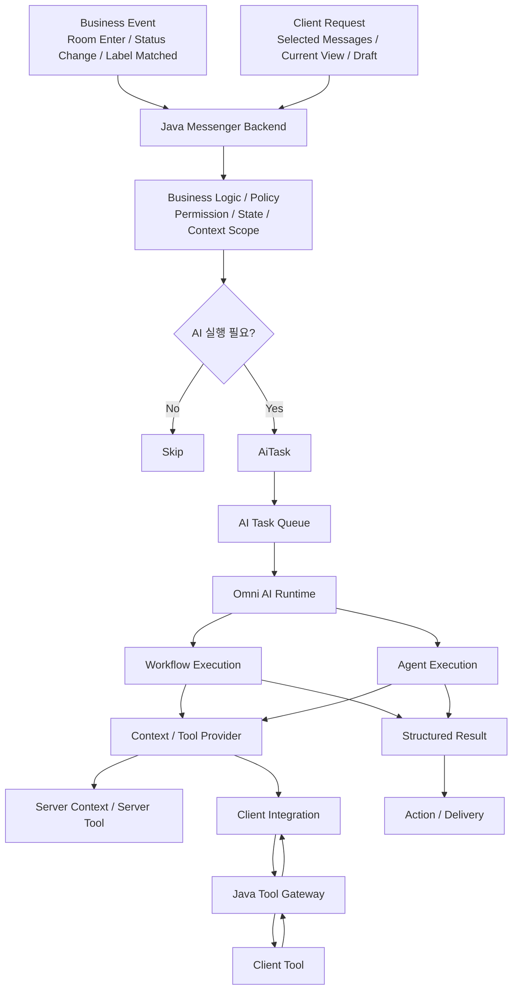

# Omni AI Platform

> **Messenger Business Event를 AI 실행의 시작점으로 확장하고,  
> Java Backend와 Omni AI Runtime을 분리해 다양한 AI 기능을 공통 구조에서 실행하기 위한 플랫폼 설계**


---

## Why Omni AI?

기존 Messenger AI는 보통 `/요약`, `/번역`, `/질문`처럼 **사용자의 직접 요청**에서 시작한다.

Omni AI는 여기서 한 단계 확장해, Messenger가 이미 알고 있는 **Business Event, User State, Business Data**를 AI 실행의 시작점으로 활용한다.

예를 들어:

- 채팅방 진입 → 대화 시작 문장 추천
- OFFLINE → ONLINE 상태 변경 → 자리비움 동안의 중요 메시지 요약
- Label Matched → AI 판단 후 Popup / Push / Navigation / Voice 전달

핵심은 **AI가 기능의 시작점이 되는 것이 아니라, Messenger Business Logic이 AI 실행 여부를 판단하는 것**이다.

---

## Architecture



### Responsibility

| Layer | Responsibility |
| --- | --- |
| **Java Messenger Backend** | Business Event, User State, Permission, Business Policy, AiTask 생성 |
| **AI Task Queue** | Messenger와 AI 실행 분리, workload buffering |
| **Omni AI Runtime** | Workflow / Agent 실행, Context 구성, LLM / Tool Orchestration |
| **Client Integration** | Client Context / Client Tool을 Omni AI에 연결하는 연동 계층 |
| **Java Tool Gateway** | Client Tool 요청 전달, Session / Permission / Correlation |
| **Client** | UI / Local Context 제공, Tool 실행 |
| **Action / Delivery** | Suggestion, Popup, Push, Navigation, Voice |

---

## Core Design

### 1. Business Event와 AiTask를 분리

```text
ROOM_ENTERED
= 무슨 일이 발생했는가

CONVERSATION_START
= AI가 무엇을 수행해야 하는가
```

```text
Business Event
    ↓
Business Policy
    ↓
AiTask
```

Business Event가 발생했다고 해서 항상 AI Task가 생성되는 것은 아니다.

---

### 2. AI 실행 판단은 Java Backend에서

```text
Business Event / Client Request
        ↓
Feature Service / Handler
        ↓
Feature / Permission / Cooldown / Context Policy
        ↓
SKIP or EXECUTE
```

AI 실행이 확정된 경우에만 `AiTask`를 생성한다.

---

### 3. 실행 확정 Task만 Queue에 전달

```text
Business Logic
    ↓
Business Policy
    ↓
AiTask
    ↓
AI Task Queue
    ↓
Omni AI
```

Queue는 모든 Business Event를 전달하는 Event Bus가 아니라, **AI 실행이 확정된 작업을 비동기로 전달하는 실행 경계**로 사용한다.

초기에는 Queue 하나로 시작하고, 실제 부하 특성이 확인되면 다음과 같이 workload 기준으로 분리한다.

```text
REALTIME / NORMAL / BACKGROUND / HEAVY
```

---

## AI Execution Modes

Omni AI Runtime은 Task의 특성에 따라 두 가지 실행 방식을 사용한다.

### Workflow Execution

필요한 Context와 처리 순서가 비교적 명확한 기능.

```text
AiTask
→ Context Resolution
→ Workflow
→ AI Processing
→ Result
```

대표 예:

- Conversation Start Recommendation
- Urgent Message Summary
- Label 기반 분류 / 요약

Workflow Execution에서도 필요한 Context가 Client에만 존재한다면 Client Integration을 사용할 수 있다.

---

### Agent Execution

실행 도중 다음 단계나 Tool 사용 여부를 AI가 동적으로 결정하는 기능.

```text
AiTask
→ Agent Runtime
→ Tool Decision
→ Tool Call
→ Tool Result
→ Agent Resume
→ Final Result
```

대표 예:

- 현재 UI 상태를 확인한 뒤 추가 Client Tool 호출
- 선택된 메시지를 조회한 뒤 다음 Tool 결정
- 여러 Server / Client Tool을 순차 호출한 뒤 최종 응답 생성

Agent Execution의 핵심은 **Client를 사용한다는 점이 아니라, Runtime 중 Tool 사용 여부와 다음 단계를 동적으로 결정한다는 점**이다.

---

## Client Integration

Client Integration은 별도의 AI 실행 방식이 아니다.

**Workflow Execution 또는 Agent Execution이 사용할 수 있는 Context / Tool Provider**이다.

Server에서 직접 접근할 수 없는 UI / Local Context 또는 Client Tool이 필요한 경우 Java Messenger Server를 Gateway로 사용한다.

```text
Omni AI Runtime
   ↓ Client Context / Tool 필요
Java Tool Gateway
   ↓ WebSocket
Client Tool
   ↓
Java Tool Gateway
   ↓
Omni AI Runtime
```

Java Messenger Server는 기존에 관리하던 책임을 유지한다.

- Authentication
- User Session
- WebSocket Connection
- Permission
- Device State

Client Tool은 전체 데이터를 전달하지 않고 **AI Task에 필요한 최소 범위만 제공**한다.

예:

```text
getSelectedMessages()
getCurrentView()
getRecentLocalMessages(limit)
getCurrentDraft()
```

지양:

```text
getAllClientData()
getAllChatHistory()
```

Context 처리 역할은 다음처럼 구분한다.

```text
Client
→ Scope Reduction

Java Server
→ Business Filtering

Omni AI
→ Semantic Filtering / Ranking / Summary
```

---

## Workflow와 Client Integration 관계

Client Integration은 Workflow / Agent와 같은 축의 개념이 아니다.

```text
Execution Mode
├─ Workflow Execution
└─ Agent Execution

Context / Tool Provider
├─ Server Context / Server Tool
└─ Client Integration
```

예를 들어:

```text
Workflow Execution
→ Client Context 필요
→ Java Tool Gateway
→ Client Tool
→ Context 확보
→ Workflow 계속 실행
```

또는:

```text
Agent Execution
→ Tool Decision
→ Client Tool 선택
→ Java Tool Gateway
→ Client Tool
→ Tool Result
→ Agent Resume
```

처럼 같은 Client Integration을 서로 다른 Execution Mode에서 사용할 수 있다.

---

## Communication

통신 방식은 하나로 통일하지 않고 역할에 따라 구분한다.

```text
AI Task Dispatch
= Queue

Omni AI ↔ Java Tool Gateway
= gRPC / Internal RPC

Java ↔ Client
= WebSocket
```

통일하는 대상은 Transport가 아니라 **AiTask / Execution / Tool Call의 실행 계약**이다.

Agent Execution에서 여러 Tool Call이 필요한 경우 다음 식별자를 기준으로 요청과 응답을 연결한다.

```text
taskId
executionId
toolCallId
```

---

## Representative Use Cases

| Use Case | Trigger | AI Task | Execution | Delivery |
| --- | --- | --- | --- | --- |
| **Conversation Start** | Room Enter | `CONVERSATION_START` | Workflow | Client Suggestion |
| **Urgent Message Summary** | OFFLINE → ONLINE | `URGENT_MESSAGE_SUMMARY` | Workflow | Popup / Navigation |
| **Label Multimodal Action** | Label Matched | `LABEL_MULTIMODAL_ACTION` | Workflow | Popup / Push / Voice |
| **Client Context 기반 AI 요청** | Client Request | Task별 정의 | Workflow 또는 Agent | Result / Action |

---

## Project Status

| Area | Status |
| --- | --- |
| Overall Architecture | **Designed** |
| Server-driven AI Flow | **Designed** |
| AiTask / Queue Model | **Designed** |
| Client Integration | **Designed** |
| Agent Runtime / Runtime Tool Calling | **Planned** |
| Workload Queue Separation | **Planned** |
| Context Store / Cache / Observability | **Planned** |

---

## Documentation

```text
docs/
├─ architecture.md
├─ server-driven-ai.md
├─ ai-task-and-queue.md
├─ client-integration.md
├─ design-decisions.md
├─ roadmap.md
├─ decisions/
│  └─ README.md
└─ notes/
   ├─ README.md
   ├─ phase-1-server-driven.md
   └─ troubleshooting.md
```

| Document | Role | When to update |
| --- | --- | --- |
| [Architecture](docs/architecture.md) | 전체 구조, Layer 책임, 실행 축을 설명하는 기준 문서 | 책임 경계, 실행 흐름, Runtime 구조가 바뀔 때 |
| [Server-driven AI](docs/server-driven-ai.md) | Business Event / Client Request가 AiTask로 전환되는 흐름 설명 | Trigger, Handler, Policy 조합 방식이 바뀔 때 |
| [AiTask and Queue](docs/ai-task-and-queue.md) | AiTask 모델과 Queue 실행 경계 설명 | Task schema, queue, retry, workload 정책이 바뀔 때 |
| [Client Integration](docs/client-integration.md) | Client Context / Client Tool을 Provider로 연결하는 방식 설명 | Client Tool, Gateway, correlation, timeout 구조가 바뀔 때 |
| [Design Decisions](docs/design-decisions.md) | 주요 설계 결정의 요약 인덱스 | 핵심 설계 판단이 추가되거나 방향이 바뀔 때 |
| [Roadmap](docs/roadmap.md) | 구현 순서와 진행 상태 관리 | Phase 상태나 개발 순서가 바뀔 때 |
| [Decisions](docs/decisions/README.md) | 개별 ADR을 모으는 디렉터리 | 되돌리기 어려운 기술 / 설계 결정을 기록할 때 |
| [Notes](docs/notes/README.md) | 개발 중 메모, 트러블슈팅, Phase별 회고를 모으는 디렉터리 | 구현 중 문제, 해결, 회고, 실험 결과가 생길 때 |

---

## Roadmap

```text
Phase 1
Server-driven 기본 구조
→ Conversation Start E2E

Phase 2
두 번째 Use Case
→ 공통 구조 재사용 검증

Phase 3
Client Integration
→ Client Tool Registry / Java Tool Gateway

Phase 4
Agent Runtime
→ Runtime Tool Calling / Correlation / Timeout

Phase 5
Context Store / Cache / Observability
→ workload 최적화
```

---

## Summary

Omni AI Platform은 **Messenger의 Business Event와 Client Request를 AI 실행 후보의 진입점으로 삼고, User State와 Business Data를 실행 판단과 Context 구성에 활용하는 공통 AI 실행 구조**를 목표로 한다.

Java Messenger Backend는 Business Policy를 통해 AI 실행 여부를 판단하고 `AiTask`를 생성하며, Omni AI는 Task 특성에 따라 Workflow 또는 Agent 방식으로 실행한다.

Client Integration은 별도의 실행 방식이 아니라, Workflow 또는 Agent가 Server에서 직접 확보할 수 없는 Client Context와 Tool을 사용할 수 있도록 연결하는 공통 Provider 계층이다.
