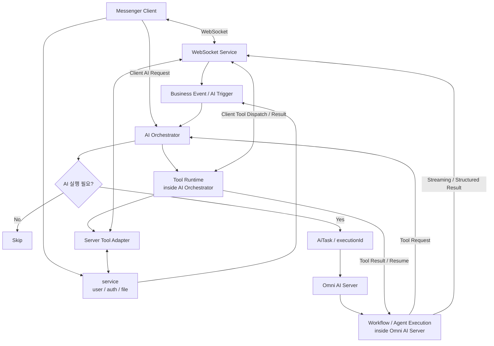

# Omni AI Platform

> **Messenger Business Event를 AI 실행의 시작점으로 확장하고,
> 현재 `WebSocket Service`, `TCP Realtime Service`와 연동되는 `AI Orchestrator`, `Omni AI Server`를 중심으로
> 다양한 AI 기능을 공통 구조에서 실행하기 위한 플랫폼 설계**


---

## Why Omni AI?

기존 Messenger AI는 대부분 `/요약`, `/번역`, `/질문`처럼 **사용자가 AI 기능을 직접 호출하는 방식**으로 동작한다.

이 방식에서는 사용자가 먼저 상황을 인지하고, 어떤 AI 기능이 필요한지 판단한 뒤, 직접 AI에게 요청해야 한다.

하지만 Messenger Backend는 이미 사용자의 업무 흐름을 이해할 수 있는 많은 정보를 가지고 있다.

* 어떤 채팅방에 진입했는지
* 얼마나 많은 메시지를 읽지 않았는지
* 사용자가 자리를 비웠다가 복귀했는지
* 어떤 메시지가 특정 Label이나 업무 조건에 해당하는지
* 어떤 대화가 장시간 응답되지 않았는지
* 어떤 Business Event가 발생했는지

즉, **AI에게 다시 상황을 설명하지 않아도 Messenger는 이미 사용자의 현재 상태와 업무 Context를 알고 있다.**

Omni AI는 이러한 정보를 AI의 입력 데이터로만 활용하는 것이 아니라,
**AI가 필요한 순간을 Messenger가 판단하고 적절한 실행으로 연결하는 것**을 목표로 한다.

```text
Omni AI

Business Event / User State / Business Data / User Request
        ↓
Messenger Business Logic
        ↓
AI execution decision
        ↓
Context-aware AI
        ↓
Popup / Push / Navigation / Voice / Suggestion
```

예를 들어,

* 채팅방 진입
  → 현재 대화 Context를 기반으로 대화 시작 문장 추천

* OFFLINE → ONLINE 상태 변경
  → 자리비움 동안 쌓인 메시지 중 확인이 필요한 내용 요약

* 여러 대화방에서 특정 업무 조건 발생
  → 중요 상황을 판단하고 사용자에게 선제적으로 안내

* Label Matched
  → AI 판단 후 Popup / Push / Navigation / Voice 등 적절한 방식으로 전달

* `/요약`, `/질문`과 같은 사용자 직접 요청
  → 동일한 AI 실행 구조를 통해 처리

이 구조에서 AI는 독립적인 기능의 시작점이 아니다.

**Messenger가 관리하는 Business Logic과 Business State를 중심으로 실행 필요성을 판단하고, AI는 필요한 Context를 해석하여 결과를 생성한다.**

Omni AI의 목적은 AI 기능을 단순히 더 많이 추가하는 것이 아니라,

> **User Request뿐 아니라 Messenger가 이미 알고 있는 Business Event, User State, Business Data를 하나의 AI 실행 구조로 연결하는 것**

이다.


---

## Current Scope

현재 Messenger Backend는 `WebSocket Service`가 인증, 파일, 실시간 채팅, 쪽지, 알림, 사용자 상태, REST API 등을 함께 처리하는 구조다.

또한 WebSocket 기반 Client뿐 아니라 TCP 연결 기반의 `TCP Realtime Service`도 동일한 AI 기능과 요청 / 응답 규격을 제공해야 한다.

Omni AI Architecture의 우선 범위는 WebSocket Service를 즉시 분리하는 것이 아니라, WebSocket Service와 TCP Realtime Service가 공통으로 사용할 수 있는 `AI Orchestrator`와 `Omni AI Server`의 책임 경계를 정의하고 구축하는 것이다.

아래 Architecture Diagram은 현재 배포 구조가 아니라, WebSocket Service 책임을 점진적으로 분리했을 때의 **Target Architecture / Evolution Direction**이다.

TCP Realtime Service는 대표 다이어그램을 복잡하게 만들지 않기 위해 생략하며, 동일한 AI 실행 규격을 사용하는 channel 확장 경로로 [ADR 003](docs/decisions/003-spring-boot-runtime.md)과 [Implementation](docs/implementation/README.md)에서 다룬다.

서비스 분리 방향은 [Service Boundary and Migration](docs/service-boundary-and-migration.md)에서 별도로 다룬다.

---

## Target Architecture / Evolution Direction



### Responsibility

아래 책임표는 Target Architecture 기준이다. 현재는 일부 책임이 `WebSocket Service` 안에 함께 존재할 수 있다.

| Layer | Responsibility |
| --- | --- |
| **WebSocket Service** | WebSocket Connection, Chat / Note / Alert, History REST, Realtime Push, AI Streaming Result 전달 |
| **user-service** | User Profile, Organization / Class, Rule / Cache, Presence, Friend Memo, Label / Address Book |
| **auth-service** | Authentication, Token Policy, JWT / Cookie Policy, User / Tenant Authentication Context |
| **file-service** | File Upload / Download, Metadata, Permission, Attachment |
| **AI Orchestrator** | Cross-service AI coordination, Trigger Policy, Context Assembly, Conversation Metadata, Tool Runtime, Tool Lifecycle, Result Routing |
| **Tool Runtime** | `AI Orchestrator` 내부 책임. Tool registry, schema validation, permission, dispatch, timeout, retry, result normalization, execution resume 조정 |
| **Server Tool Adapter** | Tool Runtime의 server-side adapter. Server-side tool/context 요청을 `auth-service`, `file-service`, `user-service`, `WebSocket Service`로 중계 |
| **Omni AI Server** | Workflow / Agent 실행, Prompt / LangGraph / LLM / Tool Decision, Conversation History / Runtime State |
| **Client Tool Delivery** | `WebSocket Service` 내부 책임. Client Tool 요청 전달, Session lookup, WebSocket delivery, Client result ingress |
| **NATS JetStream** | 재처리가 필요한 Business Event / AI Trigger 전달 |
| **Core NATS** | LLM Streaming / Execution Progress / Client Tool dispatch를 현재 Session Owner 기준으로 low-latency routing |

---

## Core Principles

### 1. Business Event와 AiTask를 분리

```text
USER_RETURNED
= 무슨 일이 발생했는가

URGENT_MESSAGE_SUMMARY
= AI가 무엇을 수행해야 하는가
```

Business Event가 발생했다고 해서 항상 AI Task가 생성되는 것은 아니다. Policy를 통과해 실행이 확정된 경우에만 `AiTask`를 만든다.

### 2. Service Ownership 유지

각 Service는 자신의 Business State와 Policy의 Source of Truth를 유지한다.

```text
WebSocket Service     → WebSocket, Chat / Note / Alert, Realtime Delivery
TCP Realtime Service  → TCP Connection, TCP Session, Realtime Delivery
user-service          → User, Presence, Rule, Label
auth-service          → Authentication, Token Policy
file-service          → File, Attachment, Permission
```

`AI Orchestrator`는 Domain State나 channel connection을 소유하지 않는다. 여러 Service의 상태를 조합해야 하는 AI Use Case와 공통 실행 규격만 조정한다.

### 3. Channel별 연결 책임과 AI 실행 규격 분리

초기에는 AI 실행 판단과 Context Assembly 책임을 WebSocket Service와 Omni AI Server에 분산시키는 방안도 검토할 수 있다.

하지만 WebSocket 기반 Client와 TCP 연결 기반 Client가 동일한 AI 기능, 동일한 요청 / 응답 규격, 동일한 실행 정책을 제공해야 하므로 channel별 realtime service에 AI 정책을 중복 구현하지 않는다.

```text
WebSocket Service
→ WebSocket connection / session / delivery

TCP Realtime Service
→ TCP connection / session / delivery

AI Orchestrator
→ Trigger Policy / Context Assembly / AiTask / Execution Correlation

Omni AI Server
→ Prompt / Workflow / Agent / LLM Runtime
```

이 구조에서는 channel-specific delivery와 AI execution policy가 분리된다.

### 4. AI Runtime과 Messenger Application 분리

```text
AI Orchestrator
→ Product-facing Metadata, Policy, Execution Correlation, Tool Runtime, Result Routing

Omni AI Server
→ Prompt, Workflow, LangGraph, LLM Execution, Tool Decision, Conversation History, Agent State
```

`Omni AI Server`가 Messenger topology, WebSocket / TCP routing, Authentication, Product Metadata를 직접 소유하지 않도록 한다.

---

## AI Function Models

| Model | Trigger | Main Flow | Result |
| --- | --- | --- | --- |
| Server-driven AI | Server Business Event | `user-service / Realtime Service → NATS JetStream → AI Orchestrator → Omni AI Server` | Realtime Push |
| Client-driven Command | `/요약`, `/일정`, `/번역` | `Client → AI Orchestrator → Omni AI Server` 또는 `Client → Realtime Service → AI Orchestrator → Omni AI Server` | Streaming |
| Stateful Chatbot | `conversationId + message` | `Client → AI Orchestrator → Omni AI Server` 또는 Realtime Service 경유 | Streaming / Multi-turn |

---

## Conversation Ownership

Conversation은 Product Metadata와 AI Runtime History를 분리한다.

```text
Conversation List
Client → AI Orchestrator → Conversation Metadata Store → Client

Conversation Detail History
Client → AI Orchestrator access check → Omni AI Server → History Store → AI Orchestrator → Client
```

`Omni AI Server`가 title 같은 metadata 후보를 생성할 수는 있지만, 최종 저장 owner는 `AI Orchestrator`다.

---

## Tool Runtime Boundary

Server Tool과 Client Tool은 같은 Tool lifecycle을 공유하고, 실제 실행 위치만 adapter로 분리한다.

```text
Server Tool
Omni AI Server
→ Server Tool이 필요하다고 판단
→ AI Orchestrator Tool Runtime
→ Server Tool Adapter
→ target service
→ AI Orchestrator Tool Runtime
→ Omni AI Server

Client Tool
Omni AI Server
→ Client Tool이 필요하다고 판단
→ AI Orchestrator Tool Runtime
→ Core NATS
→ Realtime Service Client Tool Delivery
→ Client Tool
→ Realtime Service Client Tool Delivery
→ Core NATS
→ AI Orchestrator Tool Runtime
→ Omni AI Server
```

`AI Orchestrator`는 Server Tool과 Client Tool의 lifecycle owner다. Realtime Service는 Client Tool의 session lookup, channel delivery, result ingress를 담당하지만, `toolCallId`, timeout, retry, result validation, execution resume 판단은 Tool Runtime에서 관리한다.

LLM token stream과 execution progress는 Tool lifecycle과 분리한다. 고빈도 streaming event는 `AI Orchestrator`가 token-by-token proxy하지 않고 `Omni AI Server → Core NATS → Realtime Service → Client` 경로로 전달한다.

---

## Communication

```text
Business Event / AI Trigger
= NATS JetStream

Execution Control
= Client / Realtime Service → AI Orchestrator → Omni AI Server

LLM Streaming
= Omni AI Server → Core NATS → Realtime Service → Client

Execution Progress
= Omni AI Server → Core NATS → Realtime Service → Client

Tool Call Control
= Omni AI Server → AI Orchestrator Tool Runtime

Server Tool Dispatch
= AI Orchestrator Tool Runtime → target service

Client Tool Dispatch
= AI Orchestrator Tool Runtime → Core NATS → Realtime Service → Client

Client Tool Result
= Client → Realtime Service → Core NATS → AI Orchestrator Tool Runtime → Omni AI Server resume
```

공통 correlation 후보:

```text
triggerId
taskId
executionId
conversationId
toolCallId
toolAttempt
idempotencyKey
```

---

## Documentation

| Document | Role |
| --- | --- |
| [Architecture](docs/architecture.md) | 전체 구조, Layer 책임, 실행 축 |
| [Service Boundary and Migration](docs/service-boundary-and-migration.md) | 현재 WebSocket Service 현실과 target service split / migration 방향 |
| [Server-driven AI](docs/server-driven-ai.md) | Business Event / Client Request가 AiTask로 전환되는 흐름 |
| [AiTask and Queue](docs/ai-task-and-queue.md) | AiTask, Trigger, Result Routing, Stream Event |
| [Client Integration](docs/client-integration.md) | Client Tool Delivery와 Client Context |
| [Design Decisions](docs/design-decisions.md) | 주요 설계 결정 요약 |
| [Implementation](docs/implementation/README.md) | 구현 구조와 runtime별 책임 |
| [Roadmap](docs/roadmap.md) | Phase와 구현 순서 |

---

## Roadmap

```text
Phase 1
Current WebSocket Service / TCP Realtime Service 연동과 Omni AI 기본 구조

Phase 2
Cross-domain Trigger / Result Routing

Phase 3
Tool Runtime / Server Tool Adapter / Client Tool Delivery

Phase 4
Stateful Chatbot / Agent Runtime

Phase 5
AI Context Projection / Cache / Observability

Future
WebSocket Service responsibility split
```

---

## Summary

현재 1차 범위는 `WebSocket Service`, `TCP Realtime Service`와 연동되는 `AI Orchestrator`, `Omni AI Server` 구축이다.

Target Architecture에서는 현재 WebSocket Service에 집중된 사용자, 인증, 파일, realtime delivery 책임을 `user-service`, `auth-service`, `file-service`, `WebSocket Service` 경계로 점진 분리하고, TCP 기반 Client는 `TCP Realtime Service`를 통해 동일한 AI 실행 규격을 사용한다. 여러 Service의 상태를 조합해야 하는 AI Use Case는 `AI Orchestrator`가 실행을 조정하고, `Omni AI Server`는 Workflow, LLM Execution, Conversation History와 Agent State를 관리한다.
