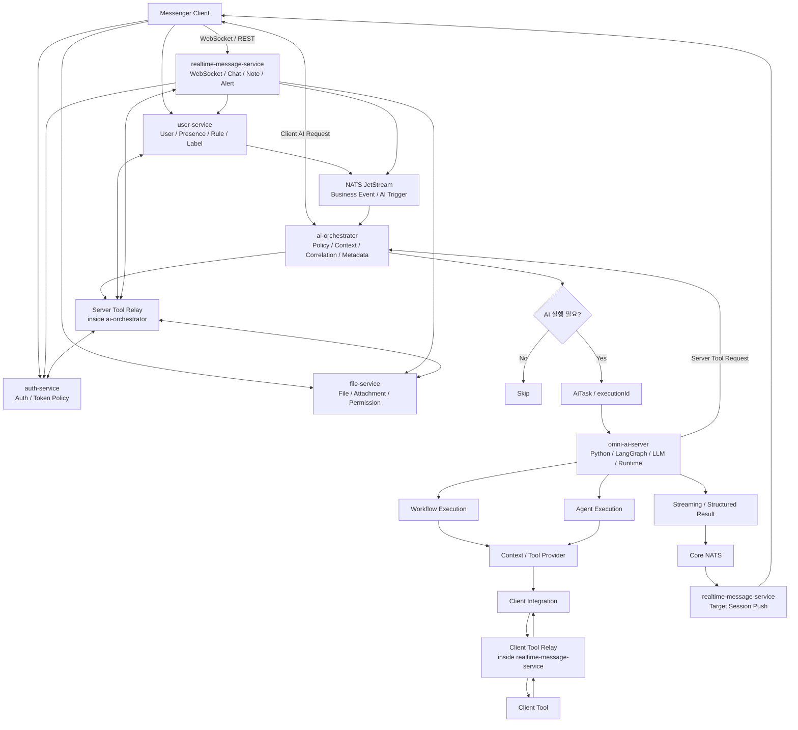

# Architecture

> Role: 전체 시스템 구조, Layer별 책임, 실행 방식과 Provider 축을 설명하는 기준 문서
> Status: Designed
> 이 문서는 README의 구조를 확장해 Omni AI Platform의 전체 책임 분리와 실행 흐름을 설명한다. 운영 구현 완료를 의미하지 않는다.

---

## 1. Architecture Goal

Omni AI Platform은 Messenger의 Business Event와 Client Request를 AI 실행 후보의 진입점으로 삼고, `ai-orchestrator`와 `omni-ai-server`의 책임을 분리하는 구조를 목표로 한다.

현재 Messenger Backend는 `WS service`가 인증, 파일, 실시간 채팅, 쪽지, 알림, 사용자 상태, REST API 등을 함께 처리하는 구조다. 이 문서의 service split diagram은 현재 배포 구조가 아니라 **Target Architecture / Evolution Direction**이다.

Target 구조에서는 각 Service가 자신의 Business State와 Policy에 대한 Source of Truth를 유지한다. `ai-orchestrator`는 여러 Service의 상태를 조합해야 하는 AI Use Case를 조정하고, `omni-ai-server`는 실행이 확정된 Task에 대해 Workflow 또는 Agent 방식으로 AI 처리를 수행한다.

---

## 2. Target High-level Flow



Status: Designed

---

## 3. Responsibility

아래 책임표는 Target Architecture 기준이다. 현재 구현에서는 `WS service`가 일부 또는 대부분의 Messenger 책임을 함께 가질 수 있다.

| Layer | Responsibility | Status |
| --- | --- | --- |
| realtime-message-service | WebSocket Connection / Session, Chat / Note / Alert, History REST, Realtime Push, AI Streaming Result 전달 | Designed |
| user-service | User Profile, Organization / Class, Rule / Cache, Presence, Friend Memo, Label / Address Book | Designed |
| auth-service | Authentication, Token Policy, JWT / Cookie Policy, User / Tenant Authentication Context | Designed |
| file-service | File Upload / Download, Metadata, Permission, Attachment | Designed |
| NATS JetStream | 재처리가 필요한 Business Event / AI Trigger 전달, durable consumer, ACK / retry | Designed |
| ai-orchestrator | Cross-domain AI Use Case 조정, Trigger Policy, Context Assembly, Cooldown / Dedup, Execution Correlation, Conversation Metadata, Server Tool Relay, Result Routing | Designed |
| omni-ai-server | Workflow / Agent 실행, Prompt / LangGraph / LLM / Tool Decision, Conversation History / Runtime State | Designed |
| Server Tool Relay | `ai-orchestrator` 내부 책임. Server-side context / tool 요청을 `auth-service`, `file-service`, `user-service`, `realtime-message-service`로 중계 | Designed |
| Client Integration | Client Context / Client Tool을 `omni-ai-server`에 연결하는 Provider 계층 | Designed |
| Client Tool Relay | `realtime-message-service` 내부 책임. Client Tool 요청 전달, Session lookup, Permission / Capability Check, Response Correlation | Designed |
| Core NATS / Realtime Delivery | LLM Streaming Result를 현재 Session Owner 기준으로 routing | Designed |

---

## 4. Core Separation

### Business Event와 AiTask

```text
USER_RETURNED
= 무슨 일이 발생했는가

URGENT_MESSAGE_SUMMARY
= AI가 무엇을 수행해야 하는가
```

Business Event가 발생했다고 해서 항상 AiTask가 생성되는 것은 아니다. Business Policy를 통과해 `EXECUTE`가 확정된 경우에만 AiTask가 만들어진다.

Single-domain AI Use Case는 해당 Service에서 직접 처리할 수 있다. Cross-domain AI Use Case는 `ai-orchestrator`에서 여러 Service의 Context를 조합한다.

현재 `WS service`가 여러 domain responsibility를 함께 가지고 있는 경우에도 원칙은 동일하다. 1차 구현에서는 `WS service`가 target service boundary의 adapter 역할을 하고, service split 이후에도 `ai-orchestrator` / `omni-ai-server` 계약이 크게 바뀌지 않게 한다.

Status: Designed

### Service Ownership과 ai-orchestrator

`ai-orchestrator`는 Messenger Application 영역의 Coordination Boundary이다.

```text
realtime-message-service
→ WebSocket / Chat / Note / Alert / Realtime Delivery

user-service
→ User / Presence / Rule / Label

auth-service
→ Authentication / Token Policy

file-service
→ File / Attachment / Permission

ai-orchestrator
→ Trigger Policy / Cross-domain Context Assembly / Execution Correlation / Conversation Metadata / Result Routing

omni-ai-server
→ Prompt / Workflow / LangGraph / LLM Execution / Conversation History / Agent State
```

`ai-orchestrator`는 사용자 상태, 메시지 상태, 인증 상태, 파일 상태의 Source of Truth가 아니다. Domain DB나 Redis를 조회해야 하는 경우에도 read-only consumer로 동작하고, 권한이나 파일 접근 정책처럼 강한 정합성이 필요한 판단은 해당 Service API / gRPC를 통해 확인한다.

Status: Designed

### Conversation Metadata와 Runtime State

`ai-orchestrator`는 Messenger Product 기능에 필요한 Conversation Metadata를 관리한다.

```text
conversationId
userId
tenantId
workflowType
title
createdAt
updatedAt
status
archived
access policy
```

`omni-ai-server`는 다음 LLM 추론에 필요한 Runtime State를 관리한다.

```text
User Turn
Assistant Turn
Conversation History
Conversation Summary
LangGraph Checkpoint
Tool State
Agent State
Prompt Context
```

WebSocket Session은 `realtime-message-service`가 관리하는 Network Connection이고, AI Conversation은 `conversationId` 기준의 Logical Conversation이다. reconnect가 발생해도 `conversationId`는 유지될 수 있다.

Status: Designed

### Conversation Query Model

Conversation list는 Product Metadata 조회이므로 `ai-orchestrator`가 Metadata Store에서 직접 응답한다.

```text
Client
→ ai-orchestrator REST API
→ Conversation Metadata Store
→ Client
```

Conversation detail history는 `ai-orchestrator`가 ownership / tenant / access policy를 확인한 뒤 `omni-ai-server`에 동기 조회한다.

```text
Client
→ ai-orchestrator REST API
→ access check
→ omni-ai-server
→ Conversation History Store
→ ai-orchestrator
→ Client
```

`ai-orchestrator`는 access gate와 response envelope을 담당하고, user / assistant turn history의 owner는 `omni-ai-server`로 둔다.

Status: Designed

### Execution Mode와 Provider

Client Integration은 Workflow / Agent와 같은 실행 방식이 아니다. Workflow와 Agent는 실행 방식이고, Client Integration은 Context나 Tool을 제공하는 계층이다.

```text
Execution Mode
├─ Workflow Execution
└─ Agent Execution

Context / Tool Provider
├─ Server Tool Request via ai-orchestrator
└─ Client Integration
```

Server Tool과 Client Tool 모두 어떤 Tool이 필요한지 판단하는 주체는 `omni-ai-server`다. 다만 Relay 책임은 다르다.

```text
Server Tool Decision
= omni-ai-server

Server Tool Relay
= ai-orchestrator

Client Tool Decision
= omni-ai-server

Client Tool Relay
= realtime-message-service
```

Status: Designed

---

## 5. AI Function Models

### Server-driven AI

```text
user-service
→ NATS JetStream
→ ai-orchestrator
→ omni-ai-server
→ Core NATS
→ realtime-message-service
→ Client
```

Trigger는 Server Business Event이고, 실행은 One-shot이며, 결과는 Realtime Push로 전달한다.

Status: Designed

### Client-driven Command

```text
Client
→ ai-orchestrator
또는
Client
→ realtime-message-service
→ ai-orchestrator
→ omni-ai-server
→ Core NATS
→ realtime-message-service
→ Client
```

Trigger는 `/요약`, `/일정`, `/번역` 같은 명시적 Client Request이고, 실행은 One-shot이며, 결과는 Streaming으로 전달한다.

Status: Designed

### Stateful Chatbot

```text
Client
→ ai-orchestrator
또는
Client
→ realtime-message-service
→ ai-orchestrator
→ omni-ai-server
→ Core NATS
→ realtime-message-service
→ Client
```

Trigger는 `conversationId + message`이고, 실행은 Multi-turn이며, State는 Conversation State다.

Status: Planned

---

## 6. Execution Modes

### Workflow Execution

필요한 Context와 처리 순서가 비교적 명확한 기능에 사용한다.

```text
AiTask
→ Context Resolution
→ Workflow
→ AI Processing
→ Structured Result
```

대표 예:

- Conversation Start Recommendation
- Urgent Message Summary
- Label 기반 분류 / 요약

Status: Designed

### Agent Execution

실행 도중 다음 단계나 Tool 사용 여부를 AI가 동적으로 결정하는 기능에 사용한다.

```text
AiTask
→ Agent Runtime
→ Tool Decision
→ Tool Call
→ Tool Result
→ Agent Resume
→ Final Result
```

Agent Execution의 핵심은 Client를 사용한다는 점이 아니라, Runtime 중 Tool 사용 여부와 다음 단계를 동적으로 결정한다는 점이다.

Status: Planned

---

## 7. Communication

통신 방식은 하나로 통일하지 않고 역할에 따라 구분한다.

```text
Business Event / AI Trigger
= NATS JetStream

Control Path
= Client / realtime-message-service → ai-orchestrator → omni-ai-server

Streaming Data Path
= omni-ai-server → Core NATS → realtime-message-service → Client

omni-ai-server ↔ realtime-message-service Client Tool Relay
= Internal RPC
```

통일하는 대상은 Transport가 아니라 `triggerId`, `taskId`, `executionId`, `conversationId`, `toolCallId` 같은 실행 계약과 식별자이다.

`ai-orchestrator`가 관리하는 Control Path:

```text
executionId
conversationId
workflow
policy
correlation
routing context
```

`omni-ai-server`가 Core NATS로 전달하는 Stream Event 후보:

```text
START
STATUS
DELTA
TOOL_CALL
COMPLETED
FAILED
```

`realtime-message-service`는 Core NATS에서 받은 stream event를 Messenger Client WebSocket Protocol로 변환하여 전달한다.

Client Tool request / response는 `ai-orchestrator`를 data path로 사용하지 않는다. `omni-ai-server`가 tool call을 요청하고, `realtime-message-service`의 Client Tool Relay가 target WebSocket session으로 relay한 뒤 결과를 `omni-ai-server`로 반환한다.

Status: Designed

---

## 8. Result Routing

Trigger 당시 `realtime-message-service` instance와 Result 전달 시점의 instance가 같다고 가정하지 않는다.

AI 처리 중 다음 상황이 발생할 수 있다.

```text
Reconnect
Scale-out
Scale-in
Instance Restart
Session Migration
```

최종 Routing 시점에는 현재 Session Owner를 기준으로 전달한다.

Status: Designed

---

## 9. Evolution Direction

현재 `WS service`가 WebSocket, Chat, Note, Alert, User State, User Info, Auth, File, REST API 책임을 동시에 가진 경우 AI Trigger, Context Assembly, LLM Streaming, Result Routing까지 직접 추가하면 Messenger Core와 AI 기능이 강하게 결합될 수 있다.

Target Architecture에서는 다음 방향으로 책임을 점진적으로 분리한다. 이 분리는 Omni AI 1차 구축 범위가 아니라 별도 migration topic이다.

```text
realtime-message-service
user-service
auth-service
file-service
ai-orchestrator
omni-ai-server
```

Spring Boot는 이 분리 자체의 목적이 아니라, 신규 Java Application Service를 구현하기 위한 후보 기술이다. `omni-ai-server`는 Python / FastAPI / LangGraph 기반 AI Runtime 영역으로 둔다.

Status: Planned

---

## 10. Scope

| Area | Status |
| --- | --- |
| Overall Architecture | Designed |
| Service Boundary | Designed |
| Server-driven AI Flow | Designed |
| Client-driven Command Flow | Designed |
| Stateful Chatbot Flow | Planned |
| AiTask / Trigger Model | Designed |
| ai-orchestrator Boundary | Designed |
| Conversation Metadata / Runtime State | Designed |
| Streaming Control / Data Path | Designed |
| NATS Trigger / Result Routing | Designed |
| Client Integration | Designed |
| Agent Runtime / Runtime Tool Calling | Planned |
| Workload Queue / Worker Separation | Planned |
| AI Context Projection / Cache / Observability | Planned |
