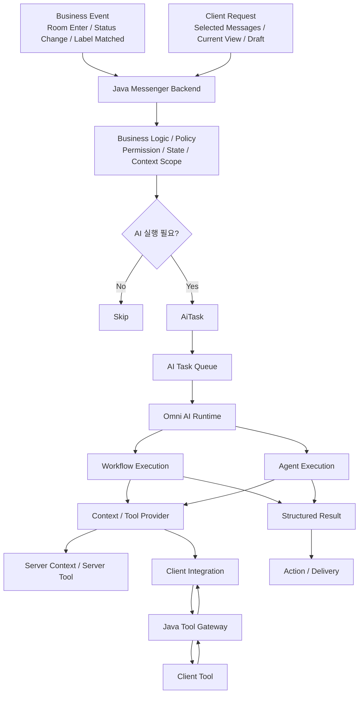

# Architecture

> Role: 전체 시스템 구조, Layer별 책임, 실행 방식과 Provider 축을 설명하는 기준 문서  
> Status: Designed  
> 이 문서는 README의 구조를 확장해 Omni AI Platform의 전체 책임 분리와 실행 흐름을 설명한다. 운영 구현 완료를 의미하지 않는다.

---

## 1. Architecture Goal

Omni AI Platform은 Messenger의 Business Event와 Client Request를 AI 실행 후보의 진입점으로 삼고, Java Messenger Backend가 Business Policy를 통해 실행 여부를 판단한 뒤 표준화된 `AiTask`를 생성하는 구조를 목표로 한다.

Omni AI Runtime은 Business Rule을 소유하지 않는다. 실행이 확정된 Task에 대해 Context를 구성하고, Workflow 또는 Agent 방식으로 AI 처리를 수행한다.

---

## 2. High-level Flow



Status: Designed

---

## 3. Responsibility

| Layer | Responsibility | Status |
| --- | --- | --- |
| Java Messenger Backend | Business Event, Client Request, User State, Permission, Business Policy, AiTask 생성 | Designed |
| AI Task Queue | Messenger와 AI 실행 분리, workload buffering, retry / backpressure 기반 | Designed |
| Omni AI Runtime | Workflow / Agent 실행, Context 구성, LLM / Tool Orchestration, Structured Result 생성 | Designed |
| Client Integration | Client Context / Client Tool을 Omni AI에 연결하는 Provider 계층 | Designed |
| Java Tool Gateway | Client Tool 요청 전달, Session / Permission / Correlation | Designed |
| Client | UI / Local Context 제공, 허용된 Tool 실행 | Designed |
| Action / Delivery | Suggestion, Popup, Push, Navigation, Voice | Designed |

---

## 4. Core Separation

### Business Event와 AiTask

```text
ROOM_ENTERED
= 무슨 일이 발생했는가

CONVERSATION_START
= AI가 무엇을 수행해야 하는가
```

Business Event가 발생했다고 해서 항상 AiTask가 생성되는 것은 아니다. Business Policy를 통과해 `EXECUTE`가 확정된 경우에만 AiTask가 만들어진다.

Status: Designed

### Execution Mode와 Provider

Client Integration은 Workflow / Agent와 같은 실행 방식이 아니다. Workflow와 Agent는 실행 방식이고, Client Integration은 Context나 Tool을 제공하는 계층이다.

```text
Execution Mode
├─ Workflow Execution
└─ Agent Execution

Context / Tool Provider
├─ Server Context / Server Tool
└─ Client Integration
```

Status: Designed

---

## 5. Execution Modes

### Workflow Execution

필요한 Context와 처리 순서가 비교적 명확한 기능에 사용한다.

```text
AiTask
→ Context Resolution
→ Workflow
→ AI Processing
→ Structured Result
```

대표 예:

- Conversation Start Recommendation
- Urgent Message Summary
- Label 기반 분류 / 요약

Status: Designed

### Agent Execution

실행 도중 다음 단계나 Tool 사용 여부를 AI가 동적으로 결정하는 기능에 사용한다.

```text
AiTask
→ Agent Runtime
→ Tool Decision
→ Tool Call
→ Tool Result
→ Agent Resume
→ Final Result
```

Agent Execution의 핵심은 Client를 사용한다는 점이 아니라, Runtime 중 Tool 사용 여부와 다음 단계를 동적으로 결정한다는 점이다.

Status: Planned

---

## 6. Client Integration Position

Server에서 직접 접근할 수 없는 UI / Local Context 또는 Client Tool이 필요한 경우 Java Messenger Server를 Gateway로 사용한다.

```text
Omni AI Runtime
   ↓ Client Context / Tool 필요
Java Tool Gateway
   ↓ WebSocket
Client Tool
   ↓
Java Tool Gateway
   ↓
Omni AI Runtime
```

Java Messenger Server는 Authentication, User Session, WebSocket Connection, Permission, Device State를 계속 소유한다.

Status: Designed

---

## 7. Communication

통신 방식은 하나로 통일하지 않고 역할에 따라 구분한다.

```text
AI Task Dispatch
= Queue

Omni AI ↔ Java Tool Gateway
= gRPC / Internal RPC

Java ↔ Client
= WebSocket
```

통일하는 대상은 Transport가 아니라 `AiTask`, `executionId`, `toolCallId` 같은 실행 계약과 식별자이다.

Status: Designed

---

## 8. Scope

| Area | Status |
| --- | --- |
| Overall Architecture | Designed |
| Server-driven AI Flow | Designed |
| AiTask / Queue Model | Designed |
| Client Integration | Designed |
| Agent Runtime / Runtime Tool Calling | Planned |
| Workload Queue Separation | Planned |
| Context Store / Cache / Observability | Planned |
