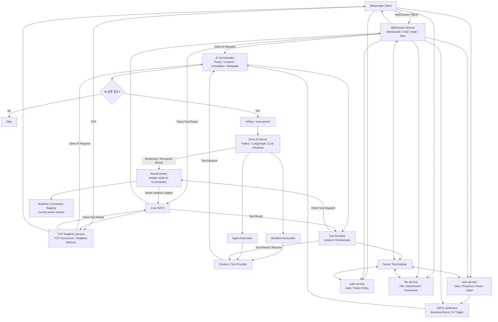

# Architecture

> Role: 전체 시스템 구조, Layer별 책임, 실행 방식과 Provider 축을 설명하는 기준 문서
> Status: Designed
> 이 문서는 README의 구조를 확장해 Omni AI Platform의 전체 책임 분리와 실행 흐름을 설명한다. 운영 구현 완료를 의미하지 않는다.

---

## 1. Architecture Goal

Omni AI Platform은 Messenger의 Business Event와 Client Request를 AI 실행 후보의 진입점으로 삼고, `AI Orchestrator`와 `Omni AI Server`의 책임을 분리하는 구조를 목표로 한다.

현재 Messenger Backend는 `WebSocket Service`가 인증, 파일, 실시간 채팅, 쪽지, 알림, 사용자 상태, REST API 등을 함께 처리하는 구조다. 또한 TCP 연결 기반 Client는 `TCP Realtime Service`를 통해 동일한 AI 기능과 요청 / 응답 규격을 제공해야 한다. 이 문서의 service split diagram은 현재 배포 구조가 아니라 **Target Architecture / Evolution Direction**이다.

Target 구조에서는 각 Service가 자신의 Business State와 Policy에 대한 Source of Truth를 유지한다. `AI Orchestrator`는 여러 Service의 상태를 조합해야 하는 AI Use Case를 조정하고, `Omni AI Server`는 실행이 확정된 Task에 대해 Workflow 또는 Agent 방식으로 AI 처리를 수행한다.

---

## 2. Target High-level Flow



Status: Designed

---

## 3. Responsibility

아래 책임표는 Target Architecture 기준이다. 현재 구현에서는 `WebSocket Service`가 일부 또는 대부분의 Messenger 책임을 함께 가질 수 있다.

| Layer | Responsibility | Status |
| --- | --- | --- |
| WebSocket Service | WebSocket Connection / Session, Chat / Note / Alert, History REST, Realtime Push, AI Streaming Result 전달 | Designed |
| user-service | User Profile, Organization / Class, Rule / Cache, Presence, Friend Memo, Label / Address Book | Designed |
| auth-service | Authentication, Token Policy, JWT / Cookie Policy, User / Tenant Authentication Context | Designed |
| file-service | File Upload / Download, Metadata, Permission, Attachment | Designed |
| NATS JetStream | 재처리가 필요한 Business Event / AI Trigger 전달, durable consumer, ACK / retry | Designed |
| AI Orchestrator | Cross-domain AI Use Case 조정, Trigger Policy, Context Assembly, Cooldown / Dedup, Execution Correlation, Conversation Metadata, Tool Runtime. 초기에는 Result Router module을 내부 배치 | Designed |
| Omni AI Server | Workflow / Agent 실행, Prompt / LangGraph / LLM / Tool Decision, Conversation History / Runtime State | Designed |
| Tool Runtime | `AI Orchestrator` 내부 책임. Tool registry, schema validation, permission, lifecycle, dispatch, timeout, retry, result normalization, execution resume 조정 | Designed |
| Server Tool Adapter | Tool Runtime의 server-side adapter. Server-side context / tool 요청을 `auth-service`, `file-service`, `user-service`, `WebSocket Service`로 중계 | Designed |
| Client Tool Integration | Client Context / Client Tool을 `Omni AI Server`에 연결하는 Provider 계층 | Designed |
| Client Tool Delivery | `WebSocket Service` 또는 `TCP Realtime Service` 내부 책임. Result Router가 선택한 instance의 local session lookup, client protocol delivery, Client Tool result ingress | Designed |
| Result Router | `routingRef` 해석, Realtime Connection Registry의 현재 owner 조회, owner instance subject publish. 초기에는 AI Orchestrator 내부 module이며 이후 분리 가능 | Designed |
| Realtime Connection Registry | Realtime Service가 등록한 현재 connection / room session / owner instance 조회. WebSocket / TCP session 자체를 소유하지 않음 | Designed |
| Core NATS / Realtime Delivery | Result Router가 선택한 owner instance로 LLM Streaming, Execution Progress, Client Tool dispatch를 저지연 전달 | Designed |

---

## 4. Core Separation

### Business Event와 AiTask

```text
USER_RETURNED
= 무슨 일이 발생했는가

RETURNED_MESSAGE_TOPICS
= AI가 무엇을 수행해야 하는가
```

Business Event가 발생했다고 해서 항상 AiTask가 생성되는 것은 아니다. Business Policy를 통과해 `EXECUTE`가 확정된 경우에만 AiTask가 만들어진다.

Single-domain AI Use Case는 해당 Service에서 직접 처리할 수 있다. Cross-domain AI Use Case는 `AI Orchestrator`에서 여러 Service의 Context를 조합한다.

현재 `WebSocket Service`가 여러 domain responsibility를 함께 가지고 있는 경우에도 원칙은 동일하다. 1차 구현에서는 `WebSocket Service`가 target service boundary의 adapter 역할을 하고, service split 이후에도 `AI Orchestrator` / `Omni AI Server` 계약이 크게 바뀌지 않게 한다.

Status: Designed

### Service Ownership과 AI Orchestrator

`AI Orchestrator`는 Messenger Application 영역의 Coordination Boundary이다.

```text
WebSocket Service
→ WebSocket / Chat / Note / Alert / Realtime Delivery

TCP Realtime Service
→ TCP Connection / Session / Realtime Delivery

user-service
→ User / Presence / Rule / Label

auth-service
→ Authentication / Token Policy

file-service
→ File / Attachment / Permission

AI Orchestrator
→ Trigger Policy / Cross-domain Context Assembly / Execution Correlation / Conversation Metadata / Tool Runtime / Result Routing

Omni AI Server
→ Prompt / Workflow / LangGraph / LLM Execution / Tool Decision / Conversation History / Agent State
```

`AI Orchestrator`는 사용자 상태, 메시지 상태, 인증 상태, 파일 상태의 Source of Truth가 아니다. 각 Domain Service가 소유한 상태는 해당 Service API / gRPC 또는 명시적으로 계약된 Projection을 통해 조회한다. `AI Orchestrator`가 직접 DB / Redis를 사용하는 범위는 cooldown, deduplication, execution correlation, conversation metadata처럼 자신이 소유한 실행 조정 상태로 제한한다.

Status: Designed

### Channel Boundary와 공통 AI 실행 규격

WebSocket Service와 TCP Realtime Service는 각자의 connection, session, delivery 책임을 유지한다.

AI 실행 판단, Trigger Policy, Context Assembly, AiTask 생성, Execution Correlation은 AI Orchestrator에서 공통화한다.

```text
WebSocket Client
→ WebSocket Service
→ AI Orchestrator
→ Omni AI Server

TCP Client
→ TCP Realtime Service
→ AI Orchestrator
→ Omni AI Server
```

이 구조는 WebSocket 경로와 TCP 경로가 동일한 AI Use Case, 요청 / 응답 규격, executionId 기반 correlation을 사용하게 한다. AI 기능이 늘어나도 channel별 realtime service에 policy를 중복 구현하지 않는다.

Status: Accepted

### Conversation Metadata와 Runtime State

`AI Orchestrator`는 Messenger Product 기능에 필요한 Conversation Metadata를 관리한다.

```text
conversationId
userId
tenantId
workflowType
title
createdAt
updatedAt
status
archived
access policy
```

`Omni AI Server`는 다음 LLM 추론에 필요한 Runtime State를 관리한다.

```text
User Turn
Assistant Turn
Conversation History
Conversation Summary
LangGraph Checkpoint
Tool State
Agent State
Prompt Context
```

WebSocket Session은 `WebSocket Service`가 관리하는 Network Connection이고, AI Conversation은 `conversationId` 기준의 Logical Conversation이다. reconnect가 발생해도 `conversationId`는 유지될 수 있다.

Status: Designed

### Conversation Query Model

Conversation list는 Product Metadata 조회이므로 `AI Orchestrator`가 Metadata Store에서 직접 응답한다.

```text
Client
→ AI Orchestrator REST API
→ Conversation Metadata Store
→ Client
```

Conversation detail history는 `AI Orchestrator`가 ownership / tenant / access policy를 확인한 뒤 `Omni AI Server`에 동기 조회한다.

```text
Client
→ AI Orchestrator REST API
→ access check
→ Omni AI Server
→ Conversation History Store
→ AI Orchestrator
→ Client
```

`AI Orchestrator`는 access gate와 response envelope을 담당하고, user / assistant turn history의 owner는 `Omni AI Server`로 둔다.

Status: Designed

### Execution Mode와 Provider

Client Tool Integration은 Workflow / Agent와 같은 실행 방식이 아니다. Workflow와 Agent는 실행 방식이고, Client Tool Integration은 Context나 Tool을 제공하는 계층이다.

```text
Execution Mode
├─ Workflow Execution
└─ Agent Execution

Context / Tool Provider
└─ Tool Request via AI Orchestrator Tool Runtime
```

Server Tool과 Client Tool 모두 어떤 Tool이 필요한지 판단하는 주체는 `Omni AI Server`다. Tool lifecycle의 owner는 `AI Orchestrator`의 Tool Runtime이고, 실제 실행 위치만 adapter와 delivery path로 분리한다.

```text
Tool Decision
= Omni AI Server

Tool Lifecycle
= AI Orchestrator Tool Runtime

Server Tool Execution
= AI Orchestrator Tool Runtime → Server Tool Adapter → target service

Client Tool Execution
= AI Orchestrator Tool Runtime → Result Router → Realtime Connection Registry에서 routingRef 기준 현재 ownerInstanceId 조회 → Core NATS owner-instance subject → Realtime Service Client Tool Delivery → local connection → Client
```

Status: Designed

---

## 5. AI Function Models

### Server-driven AI

```text
user-service
→ NATS JetStream
→ AI Orchestrator
→ Omni AI Server
→ Core NATS
→ WebSocket Service
→ Client
```

Trigger는 Server Business Event이고, 실행은 One-shot이며, 결과는 Realtime Push로 전달한다.

Status: Designed

### Client-driven Command

```text
Client
→ AI Orchestrator
또는
Client
→ WebSocket Service
→ AI Orchestrator
→ Omni AI Server
→ Core NATS
→ WebSocket Service
→ Client
```

Trigger는 `/요약`, `/일정`, `/번역` 같은 명시적 Client Request이고, 실행은 One-shot이며, 결과는 Streaming으로 전달한다.

Status: Designed

### Stateful Chatbot

```text
Client
→ AI Orchestrator
또는
Client
→ WebSocket Service
→ AI Orchestrator
→ Omni AI Server
→ Core NATS
→ WebSocket Service
→ Client
```

Trigger는 `conversationId + message`이고, 실행은 Multi-turn이며, State는 Conversation State다.

Status: Planned

---

## 6. Execution Modes

### Workflow Execution

필요한 Context와 처리 순서가 비교적 명확한 기능에 사용한다.

```text
AiTask
→ Context Resolution
→ Workflow
→ AI Processing
→ Structured Result
```

대표 예:

- Conversation Start Recommendation
- Returned Message Topic Digest
- Scheduled Weekly Report Summary
- Label 기반 분류 / 요약

Status: Designed

### Agent Execution

실행 도중 다음 단계나 Tool 사용 여부를 AI가 동적으로 결정하는 기능에 사용한다.

```text
AiTask
→ Agent Runtime
→ Tool Decision
→ Tool Call
→ Tool Result
→ Agent Resume
→ Final Result
```

Agent Execution의 핵심은 Client를 사용한다는 점이 아니라, Runtime 중 Tool 사용 여부와 다음 단계를 동적으로 결정한다는 점이다.

Status: Planned

---

## 7. Communication

통신 방식은 하나로 통일하지 않고 역할에 따라 구분한다.

```text
Business Event / AI Trigger
= NATS JetStream

Control Path
= Client / Realtime Service → AI Orchestrator → Omni AI Server

Streaming Data Path
= Omni AI Server → Result Router → Realtime Connection Registry 조회 → Core NATS → Realtime Service → Client

Execution Progress Path
= Omni AI Server → Result Router → Realtime Connection Registry 조회 → Core NATS → Realtime Service → Client

Tool Control Path
= Omni AI Server → AI Orchestrator Tool Runtime

Server Tool Dispatch
= AI Orchestrator Tool Runtime → target service

Client Tool Dispatch
= AI Orchestrator Tool Runtime → Result Router → Realtime Connection Registry 조회 → Core NATS → Realtime Service → Client

Client Tool Result
= Client → Realtime Service → Core NATS → AI Orchestrator Tool Runtime → Omni AI Server resume
```

통일하는 대상은 Transport가 아니라 `triggerId`, `taskId`, `executionId`, `conversationId`, `connectionId`, `roomSessionId`, `toolCallId`, `toolAttempt`, `idempotencyKey` 같은 실행 계약과 식별자이다.

`AI Orchestrator`가 관리하는 Control Path:

```text
executionId
conversationId
workflow
policy
correlation
routing context
tool lifecycle
```

`Omni AI Server`가 Core NATS로 전달하는 Stream Event 후보:

```text
START
STATUS
DELTA
PROGRESS
COMPLETED
FAILED
```

`Result Router`는 `routingRef`로 Realtime Connection Registry를 조회하고, 현재 `ownerInstanceId`의 Core NATS subject를 선택한다. Core NATS는 registry lookup을 수행하지 않고 선택된 subject의 event만 전달한다. `WebSocket Service`와 `TCP Realtime Service`는 해당 event를 각자의 client protocol로 변환해 자신이 소유한 local connection에 전달한다.

Client Tool request / response는 Tool Runtime을 data path로 사용한다. `Omni AI Server`가 tool call을 결정하면 `AI Orchestrator`의 Tool Runtime이 lifecycle과 routingRef를 생성한다. Result Router가 Realtime Connection Registry에서 현재 ownerInstanceId를 조회해 Core NATS owner-instance subject를 선택하고, 선택된 Realtime Service의 Client Tool Delivery가 local connection으로 전달한 뒤 결과를 Tool Runtime으로 반환한다.

LLM token stream과 execution progress는 Tool Runtime을 통과하지 않는다. Tool Runtime은 `tool_started`, `tool_progress`, `tool_completed`, `tool_failed`, `tool_timeout` 같은 Tool lifecycle event를 관리한다. 초기에는 AI Orchestrator 내부 Result Router가 routing만 수행하며, 고빈도 token stream을 Client까지 proxy하지 않는다. 필요해지면 동일한 `ResultEvent` 계약을 유지한 채 Result Router를 독립 Realtime Delivery Plane으로 분리한다.

Status: Designed

---

## 8. Result Routing

Trigger 당시 `WebSocket Service` instance와 Result 전달 시점의 instance가 같다고 가정하지 않는다.

AI 처리 중 다음 상황이 발생할 수 있다.

```text
Reconnect
Scale-out
Scale-in
Instance Restart
Session Migration
```

최종 Routing 시점에는 현재 Session Owner를 기준으로 전달한다. `enterRoom`이나 Client explicit request를 처리한 instance는 correlation 정보로만 보고, `connectionId` / `roomSessionId`를 통해 Realtime Connection Registry에서 현재 `ownerInstanceId`를 resolve한다. Result Router는 owner instance subject를 선택할 뿐 session을 소유하지 않으며, Realtime Service가 local connection으로 최종 push한다.

Status: Designed

---

## 9. Evolution Direction

현재 `WebSocket Service`가 WebSocket, Chat, Note, Alert, User State, User Info, Auth, File, REST API 책임을 동시에 가진 경우 AI Trigger, Context Assembly, LLM Streaming, Result Routing까지 직접 추가하면 Messenger Core와 AI 기능이 강하게 결합될 수 있다.

Target Architecture에서는 다음 방향으로 책임을 점진적으로 분리한다. 이 분리는 Omni AI 1차 구축 범위가 아니라 별도 migration topic이다.

```text
WebSocket Service
user-service
auth-service
file-service
AI Orchestrator
Omni AI Server
```

Spring Boot는 이 분리 자체의 목적이 아니라, 신규 Java Application Service를 구현하기 위한 후보 기술이다. `Omni AI Server`는 Python / FastAPI / LangGraph 기반 AI Runtime 영역으로 둔다.

Status: Planned

---

## 10. Scope

| Area | Status |
| --- | --- |
| Overall Architecture | Designed |
| Service Boundary | Designed |
| Server-driven AI Flow | Designed |
| Client-driven Command Flow | Designed |
| Stateful Chatbot Flow | Planned |
| AiTask / Trigger Model | Designed |
| AI Orchestrator Boundary | Designed |
| Conversation Metadata / Runtime State | Designed |
| Streaming Control / Data Path | Designed |
| NATS Trigger / Result Routing | Designed |
| Client Tool Integration | Designed |
| Agent Runtime / Runtime Tool Calling | Planned |
| Workload Queue / Worker Separation | Planned |
| AI Context Projection / Cache / Observability | Planned |
